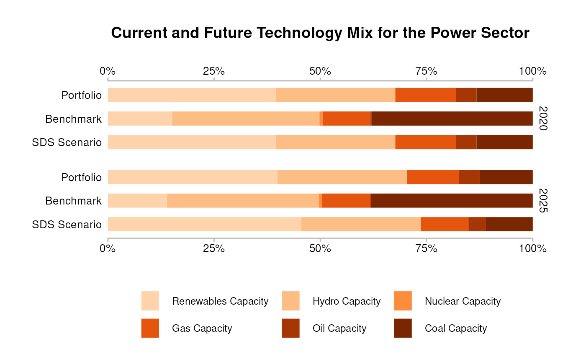
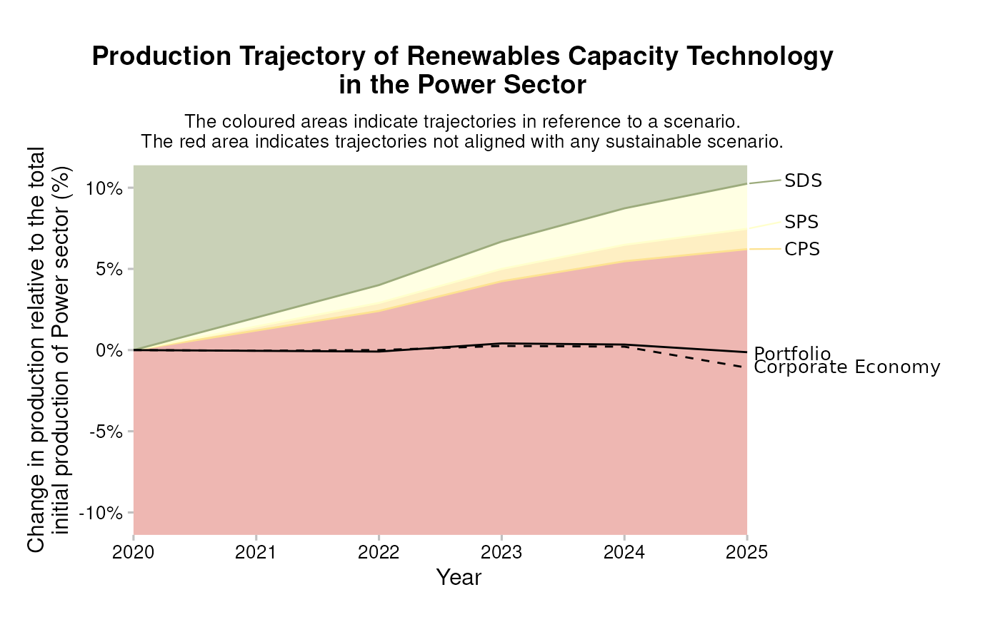

# Introduction to r2dii.analysis

## Load your r2dii libraries

The first step in your analysis will be to load in the recommended r2dii
packages into your current R session.
[r2dii.data](https://rmi-pacta.github.io/r2dii.data) includes fake data
to help demonstrate the tool and
[r2dii.match](https://rmi-pacta.github.io/r2dii.match) provides
functions to help you easily match your loanbook to asset-level data.

``` r
library(r2dii.data)
library(r2dii.match)
#> 
#> Attaching package: 'r2dii.match'
#> The following object is masked from 'package:r2dii.data':
#> 
#>     data_dictionary
library(r2dii.analysis)
#> 
#> Attaching package: 'r2dii.analysis'
#> The following object is masked from 'package:r2dii.match':
#> 
#>     data_dictionary
#> The following object is masked from 'package:r2dii.data':
#> 
#>     data_dictionary
```

To plot your results, you may also load the package
[r2dii.plot](https://rmi-pacta.github.io/r2dii.plot).

``` r
library(r2dii.plot)
#> 
#> Attaching package: 'r2dii.plot'
#> The following object is masked from 'package:r2dii.analysis':
#> 
#>     data_dictionary
#> The following object is masked from 'package:r2dii.match':
#> 
#>     data_dictionary
#> The following object is masked from 'package:r2dii.data':
#> 
#>     data_dictionary
```

We also recommend packages in the
[tidyverse](https://www.tidyverse.org/); they are optional but useful.

``` r
library(tidyverse)
#> ── Attaching core tidyverse packages ──────────────────────── tidyverse 2.0.0 ──
#> ✔ dplyr     1.1.4     ✔ readr     2.1.6
#> ✔ forcats   1.0.1     ✔ stringr   1.6.0
#> ✔ ggplot2   4.0.1     ✔ tibble    3.3.0
#> ✔ lubridate 1.9.4     ✔ tidyr     1.3.2
#> ✔ purrr     1.2.0     
#> ── Conflicts ────────────────────────────────────────── tidyverse_conflicts() ──
#> ✖ dplyr::filter() masks stats::filter()
#> ✖ dplyr::lag()    masks stats::lag()
#> ℹ Use the conflicted package (<http://conflicted.r-lib.org/>) to force all conflicts to become errors
```

## Match your loanbook to climate-related asset-level data

See [r2dii.match](https://rmi-pacta.github.io/r2dii.match) for a more
complete description of this process.

``` r
# Use these datasets to practice but eventually you should use your own data.
# The optional syntax `package::data` is to clarify where the data comes from.
loanbook <- r2dii.data::loanbook_demo
abcd <- r2dii.data::abcd_demo

matched <- match_name(loanbook, abcd) %>% prioritize()

matched
#> # A tibble: 177 × 22
#>    id_loan id_direct_loantaker name_direct_loantaker          id_ultimate_parent
#>    <chr>   <chr>               <chr>                          <chr>             
#>  1 L6      C304                Kassulke-Kassulke              UP83              
#>  2 L13     C297                Ladeck                         UP69              
#>  3 L20     C287                Weinhold                       UP35              
#>  4 L21     C286                Gallo Group                    UP63              
#>  5 L22     C285                Austermuhle GmbH               UP187             
#>  6 L24     C282                Ferraro-Ferraro Group          UP209             
#>  7 L25     C281                Lockman, Lockman and Lockman   UP296             
#>  8 L26     C280                Ankunding, Ankunding and Anku… UP67              
#>  9 L27     C278                Donati-Donati Group            UP45              
#> 10 L28     C276                Ferraro, Ferraro e Ferraro SPA UP195             
#> # ℹ 167 more rows
#> # ℹ 18 more variables: name_ultimate_parent <chr>, loan_size_outstanding <dbl>,
#> #   loan_size_outstanding_currency <chr>, loan_size_credit_limit <dbl>,
#> #   loan_size_credit_limit_currency <chr>, sector_classification_system <chr>,
#> #   sector_classification_direct_loantaker <chr>, lei_direct_loantaker <chr>,
#> #   isin_direct_loantaker <chr>, id_2dii <chr>, level <chr>, sector <chr>,
#> #   sector_abcd <chr>, name <chr>, name_abcd <chr>, score <dbl>, …
```

## Calculate targets

You can calculate scenario targets using two different approaches:
Market Share Approach, or Sectoral Decarbonization Approach.

### Market Share Approach

The [Market Share
Approach](https://rmi-pacta.github.io/r2dii.analysis/articles/target-market-share.html)
is used to calculate scenario targets for the `production` of a
technology in a sector. For example, we can use this approach to set
targets for the production of electric vehicles in the automotive
sector. This approach is recommended for sectors where a granular
technology scenario roadmap exists.

Targets can be set at the portfolio level:

``` r
# Use these datasets to practice but eventually you should use your own data.
scenario <- r2dii.data::scenario_demo_2020
regions <- r2dii.data::region_isos_demo

market_share_targets_portfolio <- matched %>%
  target_market_share(
    abcd = abcd,
    scenario = scenario,
    region_isos = regions
  )

market_share_targets_portfolio
#> # A tibble: 1,210 × 10
#>    sector     technology  year region scenario_source metric     production
#>    <chr>      <chr>      <int> <chr>  <chr>           <chr>           <dbl>
#>  1 automotive electric    2020 global demo_2020       projected     145649.
#>  2 automotive electric    2020 global demo_2020       target_cps    145649.
#>  3 automotive electric    2020 global demo_2020       target_sds    145649.
#>  4 automotive electric    2020 global demo_2020       target_sps    145649.
#>  5 automotive electric    2021 global demo_2020       projected     147480.
#>  6 automotive electric    2021 global demo_2020       target_cps    148314.
#>  7 automotive electric    2021 global demo_2020       target_sds    161823.
#>  8 automotive electric    2021 global demo_2020       target_sps    149035.
#>  9 automotive electric    2022 global demo_2020       projected     149310.
#> 10 automotive electric    2022 global demo_2020       target_cps    150923.
#> # ℹ 1,200 more rows
#> # ℹ 3 more variables: technology_share <dbl>, scope <chr>,
#> #   percentage_of_initial_production_by_scope <dbl>
```

Or at the company level:

``` r
market_share_targets_company <- matched %>%
  target_market_share(
    abcd = abcd,
    scenario = scenario,
    region_isos = regions,
    # Output results at company-level.
    by_company = TRUE 
  )
#> Warning: You've supplied `by_company = TRUE` and `weight_production = TRUE`.
#> This will result in company-level results, weighted by the portfolio
#> loan size, which is rarely useful. Did you mean to set one of these
#> arguments to `FALSE`?

market_share_targets_company
#> # A tibble: 37,349 × 11
#>    sector    technology  year region scenario_source name_abcd metric production
#>    <chr>     <chr>      <int> <chr>  <chr>           <chr>     <chr>       <dbl>
#>  1 automoti… electric    2020 global demo_2020       Bahr      proje…          0
#>  2 automoti… electric    2020 global demo_2020       Bahr      targe…          0
#>  3 automoti… electric    2020 global demo_2020       Bahr      targe…          0
#>  4 automoti… electric    2020 global demo_2020       Bahr      targe…          0
#>  5 automoti… electric    2020 global demo_2020       Beier, B… proje…          0
#>  6 automoti… electric    2020 global demo_2020       Beier, B… targe…          0
#>  7 automoti… electric    2020 global demo_2020       Beier, B… targe…          0
#>  8 automoti… electric    2020 global demo_2020       Beier, B… targe…          0
#>  9 automoti… electric    2020 global demo_2020       Bellini,… proje…          0
#> 10 automoti… electric    2020 global demo_2020       Bellini,… targe…          0
#> # ℹ 37,339 more rows
#> # ℹ 3 more variables: technology_share <dbl>, scope <chr>,
#> #   percentage_of_initial_production_by_scope <dbl>
```

### Sectoral Decarbonization Approach

The [Sectoral Decarbonization
Approach](https://rmi-pacta.github.io/r2dii.analysis/articles/target-sda.html)
is used to calculate scenario targets for the `emission_factor` of a
sector. For example, you can use this approach to set targets for the
average emission factor of the cement sector. This approach is
recommended for sectors lacking technology roadmaps.

``` r
# Use this dataset to practice but eventually you should use your own data.
co2 <- r2dii.data::co2_intensity_scenario_demo

sda_targets <- matched %>%
  target_sda(abcd = abcd, co2_intensity_scenario = co2, region_isos = regions) %>% 
  filter(sector == "cement", year >= 2020)
#> Warning: Removing rows in abcd where `emission_factor` is NA

sda_targets
#> # A tibble: 110 × 6
#>    sector  year region             scenario_source emission_factor_metric
#>    <chr>  <dbl> <chr>              <chr>           <chr>                 
#>  1 cement  2020 advanced economies demo_2020       projected             
#>  2 cement  2020 developing asia    demo_2020       projected             
#>  3 cement  2020 global             demo_2020       projected             
#>  4 cement  2021 advanced economies demo_2020       projected             
#>  5 cement  2021 developing asia    demo_2020       projected             
#>  6 cement  2021 global             demo_2020       projected             
#>  7 cement  2022 advanced economies demo_2020       projected             
#>  8 cement  2022 developing asia    demo_2020       projected             
#>  9 cement  2022 global             demo_2020       projected             
#> 10 cement  2023 advanced economies demo_2020       projected             
#> # ℹ 100 more rows
#> # ℹ 1 more variable: emission_factor_value <dbl>
```

## Visualization

There are a large variety of possible visualizations stemming from the
outputs of
[`target_market_share()`](https://rmi-pacta.github.io/r2dii.analysis/dev/reference/target_market_share.md)
and
[`target_sda()`](https://rmi-pacta.github.io/r2dii.analysis/dev/reference/target_sda.md).
Below, we highlight a couple of common plots that can easily be created
using the `r2dii.plot` package.

### Market Share: Sector-level technology mix

From the market share output, you can plot the portfolio’s exposure to
various climate sensitive technologies (`projected`), and compare with
the corporate economy, or against various scenario targets.

``` r
# Pick the targets you want to plot.
data <- filter(
  market_share_targets_portfolio,
  scenario_source == "demo_2020",
  sector == "power",
  region == "global",
  metric %in% c("projected", "corporate_economy", "target_sds")
)

# Plot the technology mix
qplot_techmix(data)
#> The `technology_share` values are plotted for extreme years.
#> Do you want to plot different years? E.g. filter . with:`subset(., year %in% c(2020, 2030))`.
#> Warning: Removed 2 rows containing missing values or values outside the scale range
#> (`geom_bar()`).
```



### Market Share: Technology-level volume trajectory

You can also plot the technology-specific volume trend. All starting
values are normalized to 1, to emphasize that we are comparing the rates
of buildout and/or retirement.

``` r
data <- filter(
  market_share_targets_portfolio,
  sector == "power",
  technology == "renewablescap",
  region == "global",
  scenario_source == "demo_2020"
)

qplot_trajectory(data)
```



### SDA Target

From the SDA output, we can compare the projected average emission
intensity attributed to the portfolio, with the actual emission
intensity scenario, and the scenario compliant SDA pathway that the
portfolio must follow to achieve the scenario ambition by 2050.

``` r
data <- filter(sda_targets, sector == "cement", region == "global")
qplot_emission_intensity(data)
```


